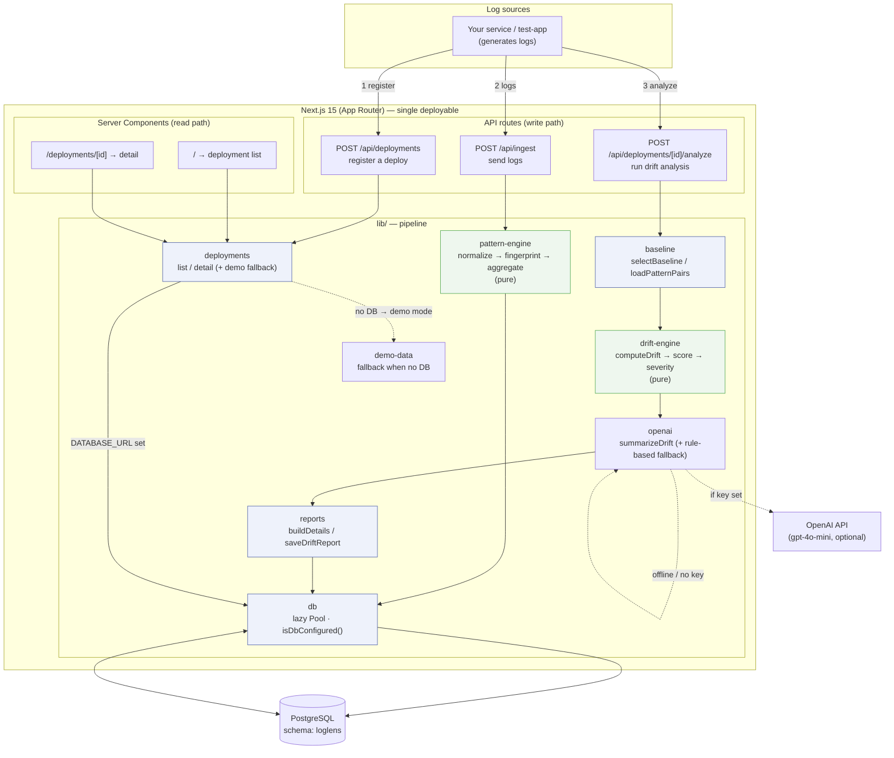
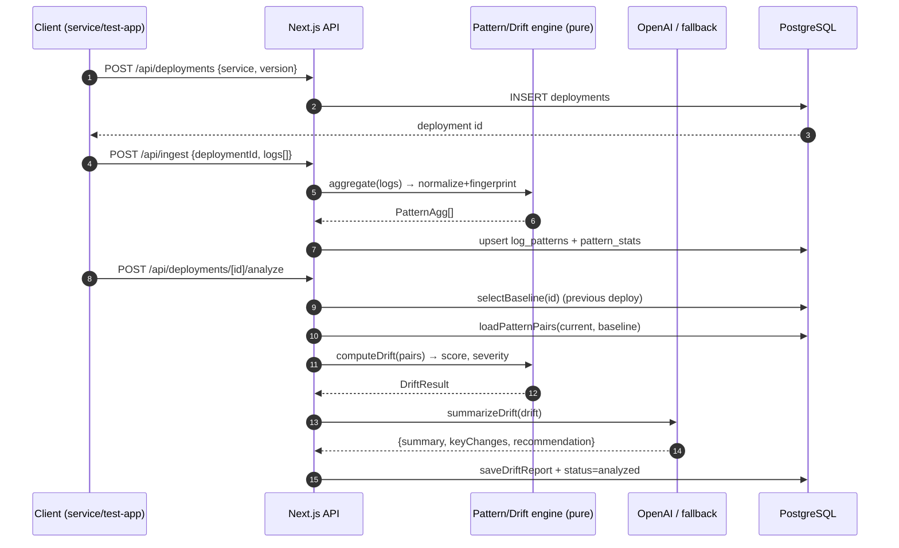
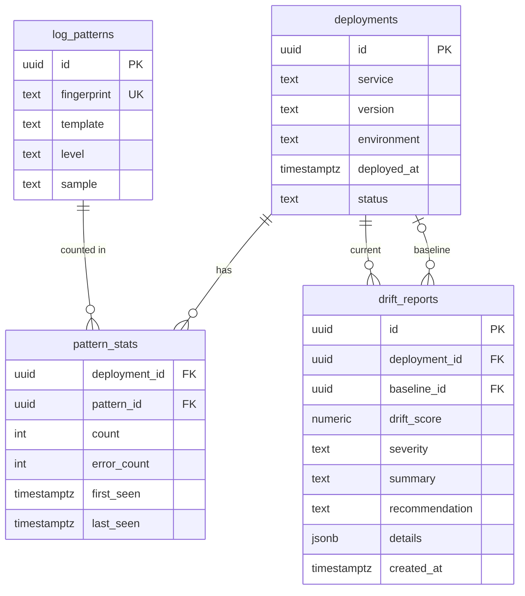

# LogLens — Architecture

LogLens detects **log pattern drift** between deployments. Raw logs are normalized into
patterns, the "before" (baseline) and "after" (current) deployments are compared by a
deterministic engine, scored 0–100, and an AI layer turns the result into a human-readable
summary with a rollback recommendation.

---

## 1. System overview

> **Read path fallback:** when `DATABASE_URL` is unset or the DB is unreachable,
> `deployments.ts` serves deterministic **demo data** (same `payment-api` scenario as the
> seed) instead of querying Postgres — so the app renders even with no database
> (e.g. on Vercel before a DB is attached). A 🧪 *Demo mode* banner is shown.

---

## 2. Ingest → Analyze pipeline

**Drift classification (per pattern):** `NEW` · `SPIKE` · `DROP` · `DISAPPEARED`
**Score (0–100):** weights new error patterns and rising error rate most heavily.
**Severity:** `safe` < 25 ≤ `warning` < 60 ≤ `critical`.

---

## 3. Data model

- **`log_patterns`** is a global pattern dictionary (one row per unique `fingerprint`);
  raw log lines are **not** stored — only a representative `sample`.
- **`pattern_stats`** holds per-deployment counts (this is what gets diffed).
- **`drift_reports.details`** (JSONB) stores the classified pattern diff + metrics + AI key changes.

---

## 4. Design principles

| Principle | How it shows up |
|-----------|-----------------|
| **Deterministic core, AI on top** | `pattern-engine` & `drift-engine` are pure functions; OpenAI only *summarizes*. |
| **Never breaks the demo** | No AI key / API failure → rule-based `fallbackSummary`. No DB → `demo-data`. |
| **Privacy / lightweight** | Original logs discarded after aggregation; only pattern stats persist. |
| **Same engine everywhere** | `seed`, test-app, and demo-data all reuse the exact `lib/` pipeline. |
| **Swap-only environments** | Local Docker PG ↔ cloud Postgres by changing `DATABASE_URL` only. |
